# AgriBackup System
A web-based application that Provides a platform for farmers to connect, with buyers, and make trade

### 🏠 Home Page
- The following is the landing page of the system.
    
- The users of the system are **farmers, buyers, and the admin**
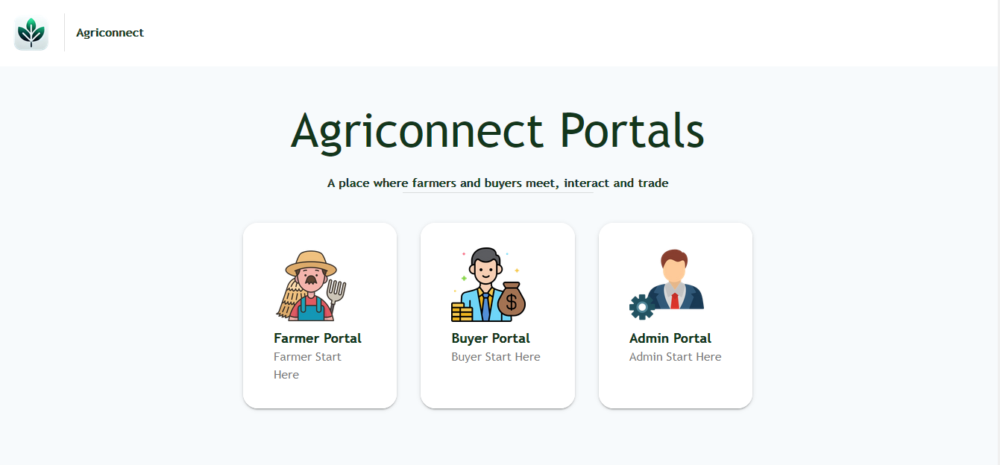
- The user will then be prompted to sign in
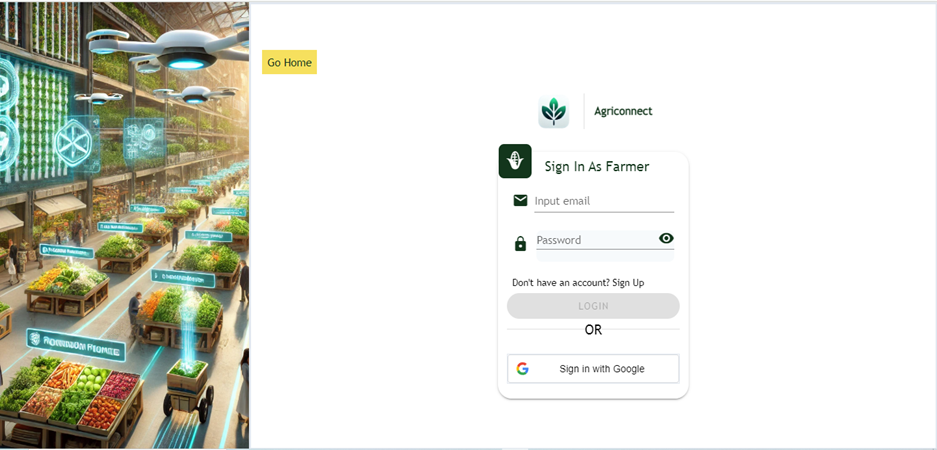
- If one does not have an account, he/she can sign up
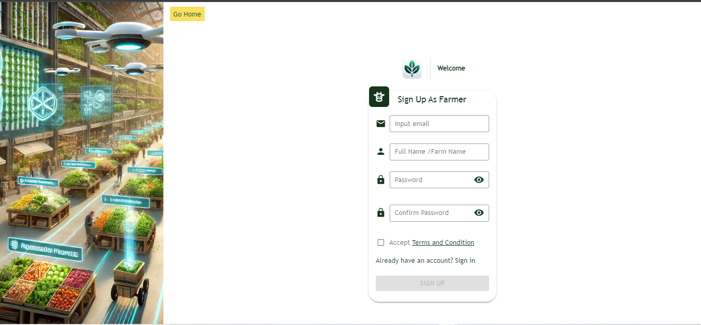
- After signing up, one will be requested to give in their location
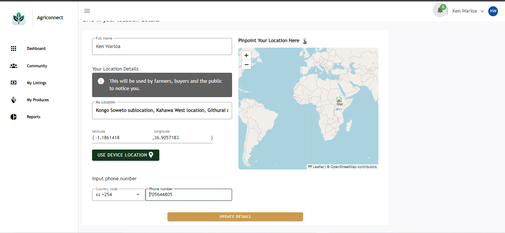

### 📊 Dashboard
The user will be taken to the dashboard 

#### Farmer dashboard
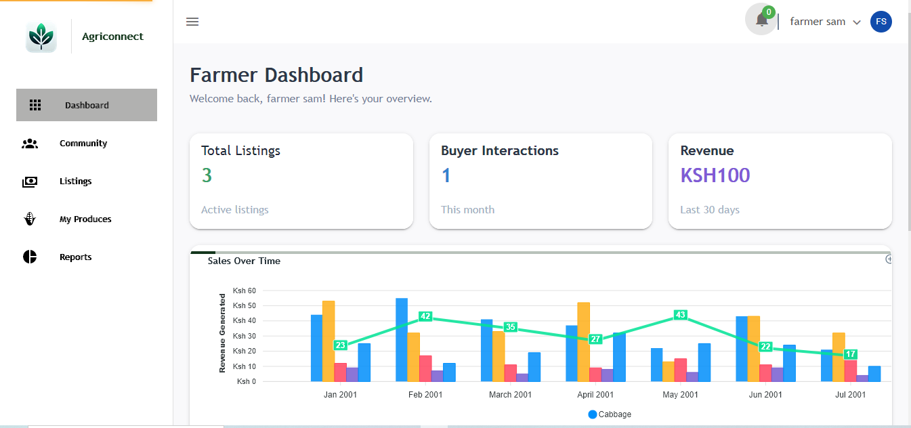
#### Buyer dashboard
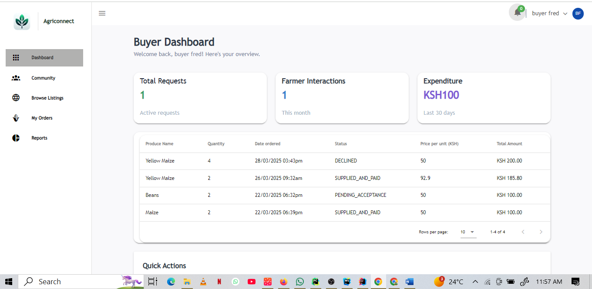
### 👨‍👩‍👧‍👧 Community
They can interact from the community section where there is **map** and connect
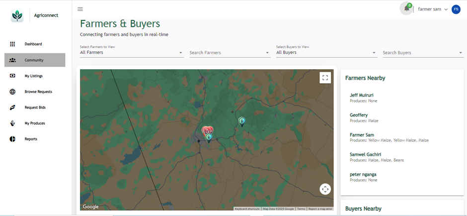
Map interactions
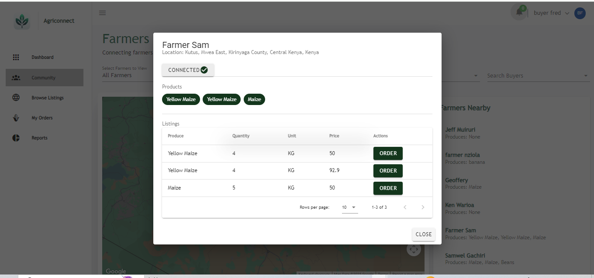
## Farmer
### 🌾 My Produces
Farmer can view his/her produces, and also make changes
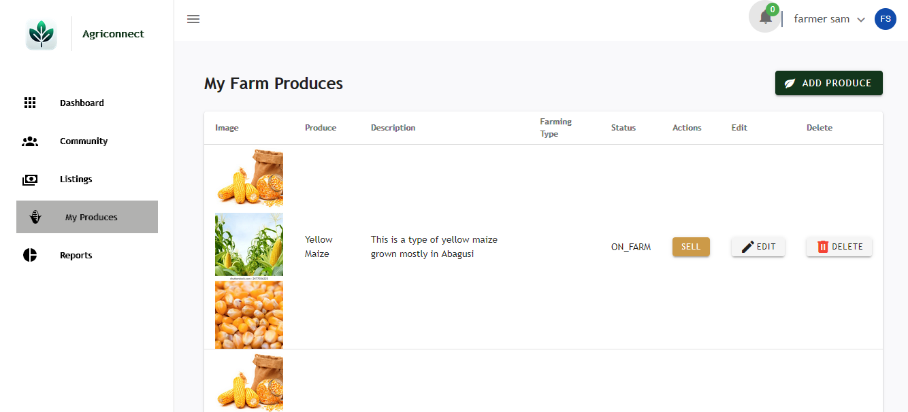
He/she can add produce
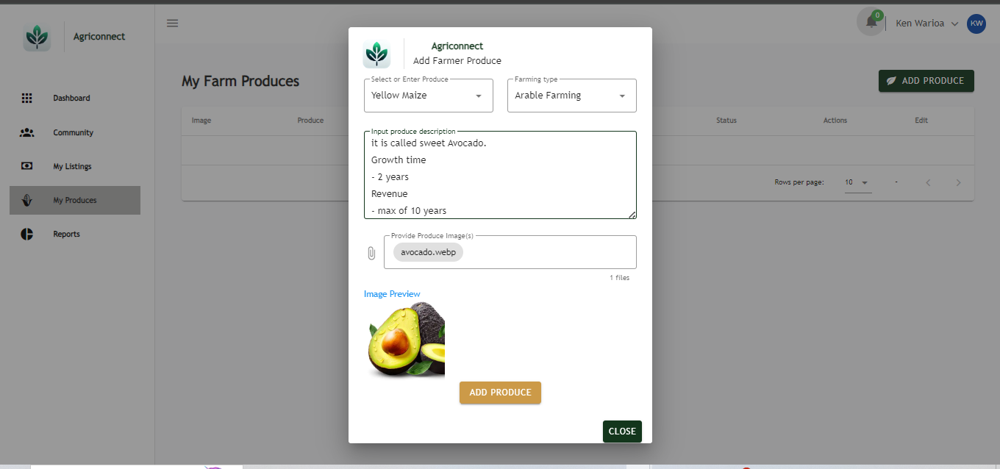
From the produce that a farmer has, he/she can post listing for it
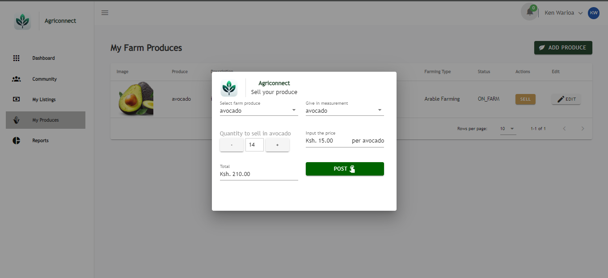
They can then view the status of their listings

## Buyers
### 🌐 Browse Listings
Buyers can view the listings
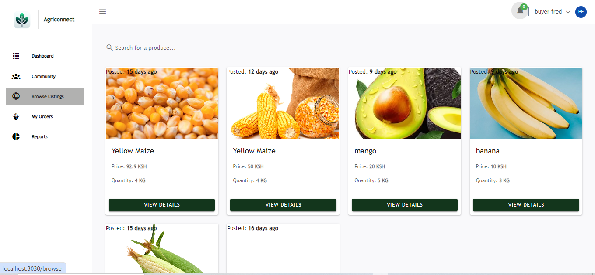
They can make an **order** for a listing
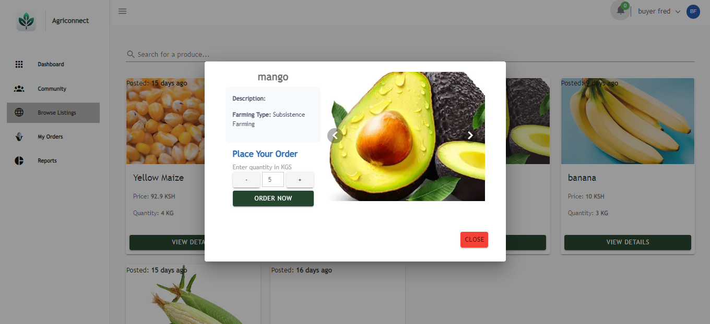
They can track orders made

## Admin
#### Admin dashboard
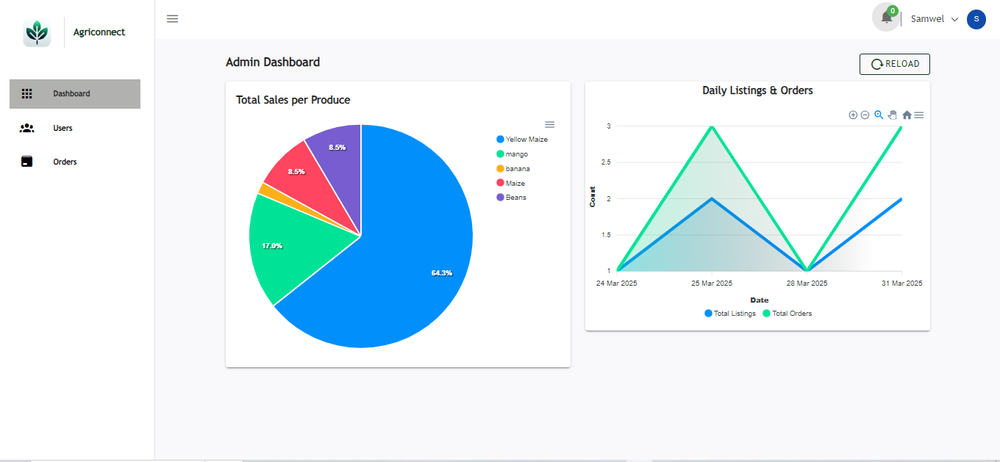
### 👥 Users Sign Up Trend
Admins can view the sign up trend over time for farmers and buyers
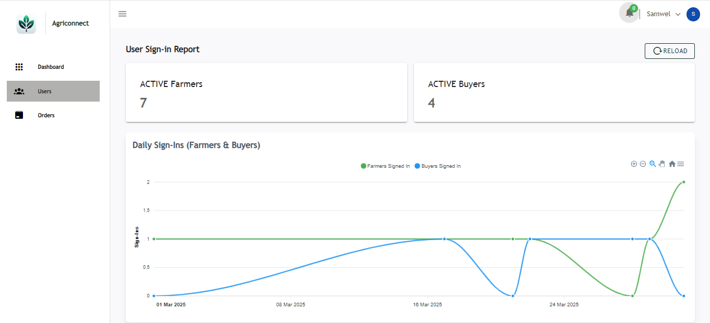
### 📦 Orders status view
They are also in charge of viewing the orders made and their status
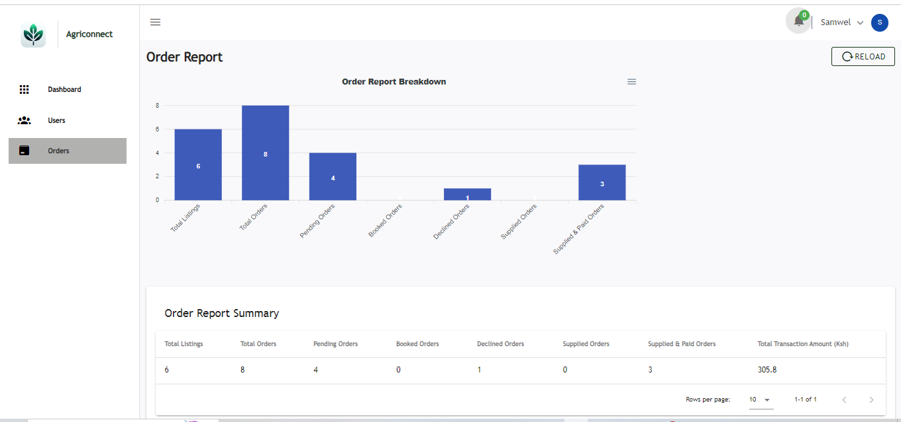